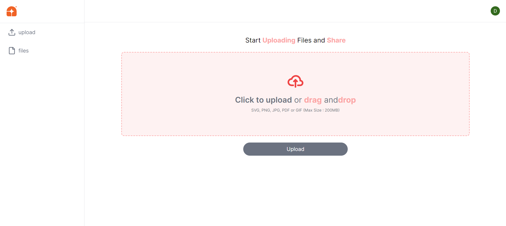
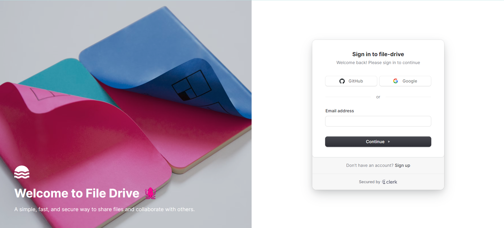

# File Drive

A File sharing web Application

## Table of contents

- [File Drive](#file-drive)
  - [Table of contents](#table-of-contents)
  - [Overview](#overview)
    - [The challenge](#the-challenge)
    - [Screenshots](#screenshots)
    - [Links](#links)
    - [Built with](#built-with)
  - [Author](#author)

## Overview

### The challenge

Users should be able to:

- Create account and login using google, facebook or github account
- Upload image and create post
- Log out feature when a user click on the user profile icon

### Screenshots

<

### Links

- Solution URL: [Click Me !](https://github.com/emmanueldonkor/file-drive)
- Live Site URL: [Click Me !](https://file-drive-gray.vercel.app/)

### Built with

- Next js
- Tailwind css
- Firebase(storage and store)
- lucide icons
- clerk
- Tyepscript

## Author

- Website - [Emmanuel Donkor](emmanueldonkor.com)
- LinkedIn- [EmmDonkor](https://www.linkedin.com/in/emmanueldonkor/)
